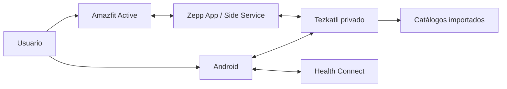
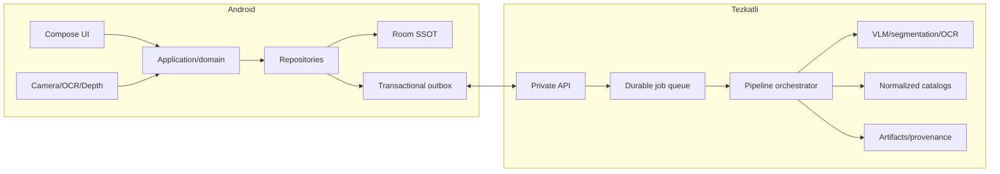

# Arquitectura del sistema

## Estilo

Monolito modular distribuido entre tres ejecutables:

1. Aplicación Android local-first.
2. API/worker privado en Tezkatli.
3. Aplicación Zepp auxiliar, condicionada por PoC.

No se adoptan microservicios, CQRS completo, event sourcing completo, Kubernetes ni CRDT en la primera etapa.

## Contexto



## Contenedores



## Propiedad de datos

| Información | Propietario operativo | Réplica/derivado |
|---|---|---|
| Entrenamientos confirmados | Room Android | Respaldo/analítica en Tezkatli |
| Alimentación confirmada | Room Android | Respaldo/analítica en Tezkatli |
| Suplementos confirmados | Room Android | Respaldo opcional |
| Trabajos de IA | Tezkatli | Estado/cache en Android |
| Artefactos de modelos | Tezkatli | Ninguna copia obligatoria en teléfono |
| Eventos del reloj no entregados | Amazfit/Side Service | Tezkatli/Android tras ACK |
| Catálogos normalizados | Tezkatli | Subconjunto cacheado en Android |

## Contextos de dominio

- Training
- Routine Planning
- Nutrition
- Supplements
- Gym Catalog
- Capture and Interpretation
- Device Integration
- Synchronization
- Analytics

## Patrones

- UDF y state holders en UI.
- Repository en fronteras de datos.
- State machine para sesión, captura y trabajos.
- Transactional Outbox para sincronización.
- Ports and Adapters para IA, catálogos y dispositivos.
- Strategy y Specification para recomendaciones.
- Composite para comidas y recetas.
- Anti-Corruption Layer para Zepp, Health Connect y catálogos.
- Proyecciones para vistas de alto rendimiento.

## Dependencias Android

```text
app → feature → data → core
integration → contracts/domain ports
core ↛ feature
```

## Decisiones pendientes

- Modelo VLM final después de benchmark.
- Runtime final de GPU en Tezkatli.
- Compatibilidad de Zepp.
- Cifrado exacto de Room según amenaza y costo medido.
- Catálogo nutricional mexicano prioritario.
